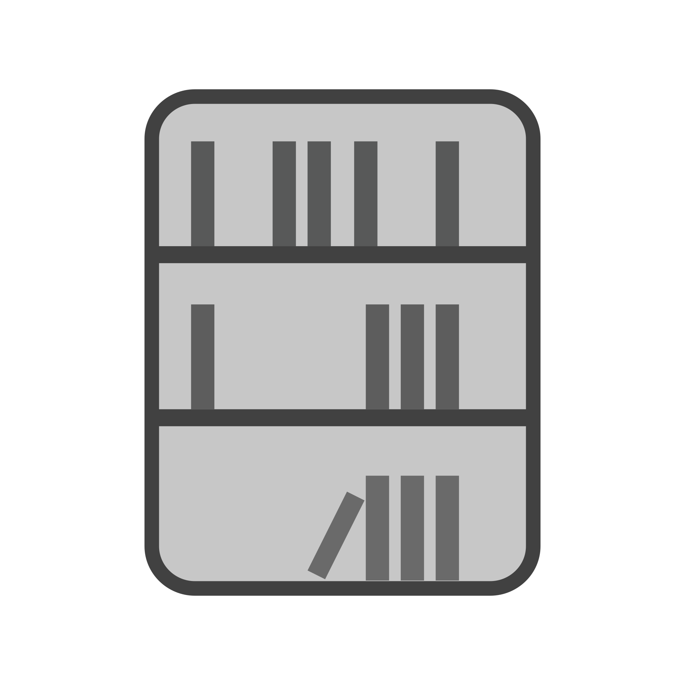

<!-- Improved compatibility of back to top link: See: https://github.com/othneildrew/Best-README-Template/pull/73 -->
<a id="readme-top"></a>
<!--
*** Thanks for checking out the Best-README-Template. If you have a suggestion
*** that would make this better, please fork the repo and create a pull request
*** or simply open an issue with the tag "enhancement".
*** Don't forget to give the project a star!
*** Thanks again! Now go create something AMAZING! :D
-->


<!-- PROJECT SHIELDS -->
<!--
*** I'm using markdown "reference style" links for readability.
*** Reference links are enclosed in brackets [ ] instead of parentheses ( ).
*** See the bottom of this document for the declaration of the reference variables
*** for contributors-url, forks-url, etc. This is an optional, concise syntax you may use.
*** https://www.markdownguide.org/basic-syntax/#reference-style-links
-->
[![Contributors][contributors-shield]][contributors-url]
[![Forks][forks-shield]][forks-url]
[![Stargazers][stars-shield]][stars-url]
[![Issues][issues-shield]][issues-url]
[![project_license][license-shield]][license-url]


<!-- PROJECT LOGO -->
<br />
<div align="center">
  <a href="https://github.com/KingCharlesVI/lexi">
    
  </a>

<h3 align="center">Lexi</h3>

  <p align="center">
    Automatic dictionary for Roblox Word Bomb
    <br />
    <a href="https://github.com/KingCharlesVI/lexi/issues/new?labels=bug&template=bug_report---.md">Report Bug</a>
    &middot;
    <a href="https://github.com/KingCharlesVI/lexi/issues/new?labels=enhancement&template=feature_request---.md">Request Feature</a>
  </p>
</div>


<!-- TABLE OF CONTENTS -->
<details>
  <summary>Table of Contents</summary>
  <ol>
    <li>
      <a href="#about-the-project">About The Project</a>
      <ul>
        <li><a href="#built-with">Built With</a></li>
      </ul>
    </li>
    <li>
      <a href="#getting-started">Getting Started</a>
      <ul>
        <li><a href="#prerequisites">Prerequisites</a></li>
        <li><a href="#installation">Installation</a></li>
      </ul>
    </li>
    <li><a href="#usage">Usage</a></li>
    <li><a href="#roadmap">Roadmap</a></li>
    <li><a href="#contributing">Contributing</a></li>
    <li><a href="#license">License</a></li>
    <li><a href="#contact">Contact</a></li>
    <li><a href="#acknowledgments">Acknowledgments</a></li>
  </ol>
</details>


<!-- ABOUT THE PROJECT -->
## About The Project

[![Product Name Screen Shot][product-screenshot]]

<p align="right">(<a href="#readme-top">back to top</a>)</p>


### Built With

* [![React][React.js]][React-url]
* [![Tauri][Tauri]][Tauri-url]

<p align="right">(<a href="#readme-top">back to top</a>)</p>


<!-- GETTING STARTED -->
## Getting Started

To get a local development copy up and running follow these simple example steps.

### Prerequisites

This is an example of how to list things you need to use the software and how to install them.
* npm
  ```sh
  npm install npm@latest -g
  ```

### Installation

1. Clone the repo
   ```sh
   git clone https://github.com/KingCharlesVI/lexi.git
   ```
3. Install NPM packages
   ```sh
   cd lexi
   npm install
   ```
5. Start the app in development mode
   ```sh
   npm run tauri dev
   ```

<p align="right">(<a href="#readme-top">back to top</a>)</p>


<!-- USAGE EXAMPLES -->
## Usage

Start the app with Roblox Word Bomb. Type the letters plainly (e.g. "ca") in the text box. Click on a word. Repeat.

<p align="right">(<a href="#readme-top">back to top</a>)</p>


<!-- ROADMAP -->
## Roadmap

- [ ] Feature 1
- [ ] Feature 2
- [ ] Feature 3
    - [ ] Sub-feature

See the [open issues](https://github.com/KingCharlesVI/lexi/issues) for a full list of proposed features (and known issues).

<p align="right">(<a href="#readme-top">back to top</a>)</p>


<!-- CONTRIBUTING -->
## Contributing

Contributions are what make the open source community such an amazing place to learn, inspire, and create. Any contributions you make are **greatly appreciated**.

If you have a suggestion that would make this better, please fork the repo and create a pull request. You can also simply open an issue with the tag "enhancement".
Don't forget to give the project a star! Thanks again!

1. Fork the Project
2. Create your Feature Branch (`git checkout -b feature/AmazingFeature`)
3. Commit your Changes (`git commit -m 'Add some AmazingFeature'`)
4. Push to the Branch (`git push origin feature/AmazingFeature`)
5. Open a Pull Request

<p align="right">(<a href="#readme-top">back to top</a>)</p>

### Top contributors:

<a href="https://github.com/KingCharlesVI/lexi/graphs/contributors">
  
</a>


<!-- LICENSE -->
## License

Distributed under the project_license. See `LICENSE.txt` for more information.

<p align="right">(<a href="#readme-top">back to top</a>)</p>


<!-- CONTACT -->
## Contact

Discord: .kingcharlesvii

Project Link: [https://github.com/KingCharlesVI/lexi](https://github.com/KingCharlesVI/lexi)

<p align="right">(<a href="#readme-top">back to top</a>)</p>


<!-- ACKNOWLEDGMENTS -->
## Acknowledgments

- 

<p align="right">(<a href="#readme-top">back to top</a>)</p>


<!-- MARKDOWN LINKS & IMAGES -->
<!-- https://www.markdownguide.org/basic-syntax/#reference-style-links -->
[contributors-shield]: https://img.shields.io/github/contributors/KingCharlesVI/lexi.svg?style=for-the-badge
[contributors-url]: https://github.com/KingCharlesVI/lexi/graphs/contributors
[forks-shield]: https://img.shields.io/github/forks/KingCharlesVI/lexi.svg?style=for-the-badge
[forks-url]: https://github.com/KingCharlesVI/lexi/network/members
[stars-shield]: https://img.shields.io/github/stars/KingCharlesVI/lexi.svg?style=for-the-badge
[stars-url]: https://github.com/KingCharlesVI/lexi/stargazers
[issues-shield]: https://img.shields.io/github/issues/KingCharlesVI/lexi.svg?style=for-the-badge
[issues-url]: https://github.com/KingCharlesVI/lexi/issues
[license-shield]: https://img.shields.io/github/license/KingCharlesVI/lexi.svg?style=for-the-badge
[license-url]: https://github.com/KingCharlesVI/lexi/blob/master/LICENSE.txt
[release-shield]: https://img.shields.io/github/v/release/KingCharlesVI/lexi
[release-url]: https://github.com/KingCharlesVI/lexi/releases
[product-screenshot]: images/lexi-ui.png
[React.js]: https://img.shields.io/badge/React-20232A?style=for-the-badge&logo=react&logoColor=61DAFB
[React-url]: https://reactjs.org/
[Tauri]: https://img.shields.io/badge/Tauri-FFC131?style=for-the-badge&logo=Tauri&logoColor=white
[Tauri-url]: https://tauri/app